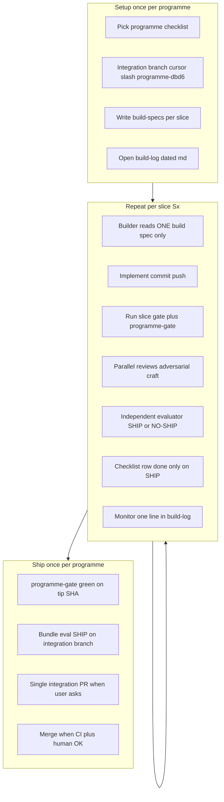
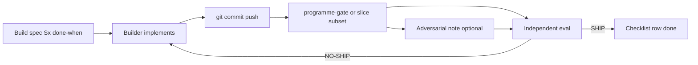
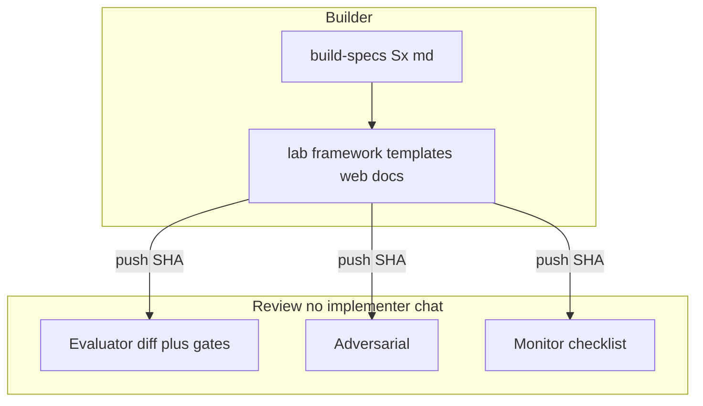
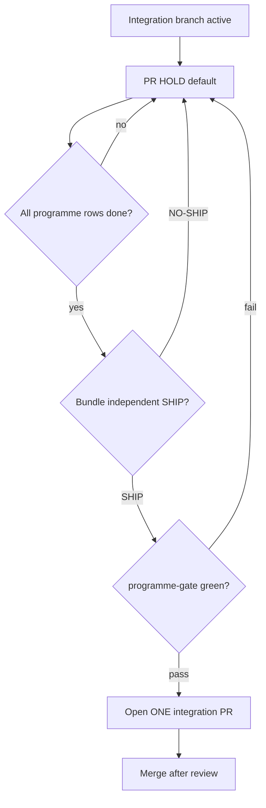
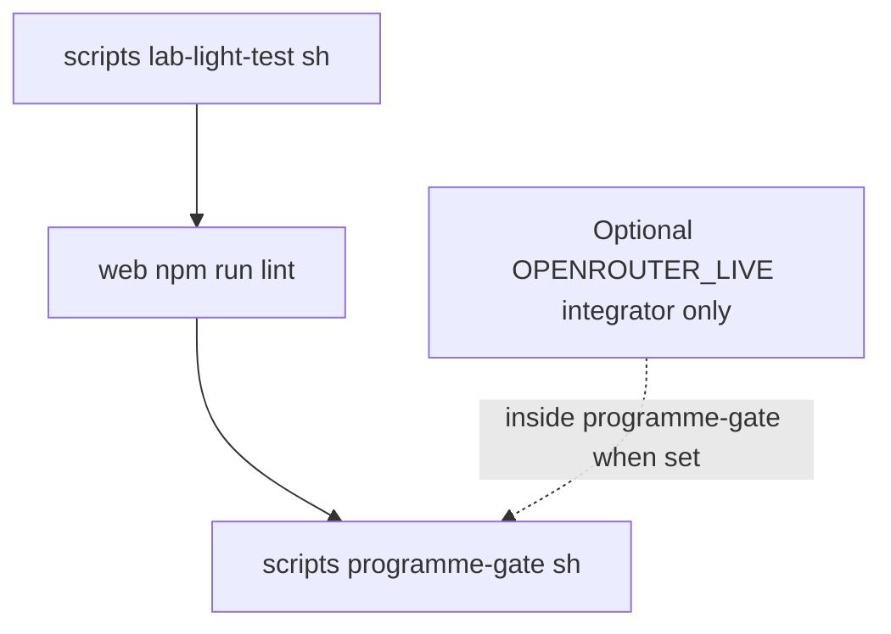

# Compound build SOP — Dify training lab

Operate a **long-horizon programme** as many **small, gated slices** on one **integration branch**, with **role-separated** agents and **one integration PR** only when the programme checklist is green and an **independent evaluator** has **SHIP**ped the bundle.

**Skill entrypoint (agents):** [skills/compound-build-loop/SKILL.md](../../skills/compound-build-loop/SKILL.md)

**Active programme checklist:** [LAB-FACTORY-CHECKLIST.md](./LAB-FACTORY-CHECKLIST.md)

**Build specs:** [build-specs/](./build-specs/)

**Build log:** [build-log/](./build-log/)

---

## When to use

- Tiered course delivery (Phase 0 → lab factory → portal BFF → cohort dry-run).
- **30-lab catalog** + Studio DSL exports where parity must not drift from blueprints.
- Multi-agent Cloud runs with **builder / eval / adversarial / monitor** lanes.
- Any change where **implementers must not self-SHIP** ([AGENTS.md](../../AGENTS.md)).

## When NOT to use

- Single-file fix, typo, or dark-mode tweak → normal commit on `main` (this repo’s default integration branch unless a programme branch is open).
- Research-only doc reads with no checklist row.
- Hotfix that explicitly skips programme gates (record exception in build-log).

---

## Programme DAG (end-to-end)



---

## Per-slice compound loop



**Rule:** The builder **never** marks a checklist row **done** from self-review. Only **independent SHIP** + green gate.

---

## Role firewall

| Role | Reads | Must NOT | Writes |
|------|--------|----------|--------|
| **Builder** | `build-specs/Sx-*.md` only | Eval rubric, adversarial playbook, other agents’ threads | Product code/docs on integration branch |
| **Independent evaluator** | Diff, gates, build spec done-when | Implementer chat | `evaluations/*-independent.md` → **SHIP \| NO-SHIP** |
| **Adversarial** | Eval inputs + [ADVERSARIAL.md](./ADVERSARIAL.md) | Fix code unless tasked | `adversarial/*-independent.md` |
| **Monitor** | Checklist + gate stdout | Product code | `build-log/*.md` rows |
| **Integrator** | `.env` / operator secrets | Parallel live OpenRouter jobs | Runs `OPENROUTER_LIVE=1` **once** per gate run |
| **PR steward** | Branch vs checklist | Open PR before bundle SHIP | Build-log note; **one PR** when allowed |



---

## PR timing



**Default:** Checklist **PR: hold** until bundle SHIP + `./scripts/programme-gate.sh` green.

This Cloud Agent project often commits to **`main`** without an MR until the user asks for a PR — treat **`main` as integration** when no programme branch exists; still follow **SHIP before “programme complete”** in the build-log.

---

## Gate stack (this repo)



| Gate | Command | Who runs |
|------|---------|----------|
| Light lab | `./scripts/lab-light-test.sh` | Any agent |
| Walkthrough lint | `cd web && npm run lint` | Any agent |
| Programme gate | `./scripts/programme-gate.sh` | Evaluator before SHIP |
| Live LLM smoke | `OPENROUTER_LIVE=1 OPENROUTER_API_KEY=… ./scripts/programme-gate.sh` | **Integrator only**, once |

Slice-specific gates belong in build spec **done-when** (e.g. `./scripts/lab-view.sh --extract <lab_id>`, `./scripts/lab-wire.sh cohort-default`, runbook exists).

---

## Operating procedure (lead agent)

### 0. Programme charter

1. Create or extend **`docs/operations/<PROGRAMME>-CHECKLIST.md`**.
2. Set **`PR: hold`** until programme complete.
3. Integration branch: `cursor/<programme>-dbd6` off `main` (optional; else use `main` + build-log discipline).
4. Start **`docs/operations/build-log/YYYY-MM-DD-<programme>.md`**.

### 1. For each slice `Sx`

1. Write **`docs/operations/build-specs/Sx-<slug>.md`** with testable **done-when** bullets.
2. **Builder** subagent: spec only → implement → commit → push.
3. Run gates in spec + **`./scripts/programme-gate.sh`** (integrator adds live OpenRouter when spec requires).
4. **Parallel** subagents: adversarial, craft read-only as needed.
5. **Independent evaluator:** gates on SHA → **`evaluations/YYYY-MM-DD-Sx-independent.md`**.
6. **SHIP:** checklist row **done (eval SHIP)**; monitor appends build-log row.
7. **NO-SHIP:** builder fixes → new commit → re-eval.

### 2. Programme completion

1. All checklist rows **done**.
2. Bundle eval **`evaluations/YYYY-MM-DD-<programme>-bundle-independent.md`** → **SHIP**.
3. `./scripts/programme-gate.sh` on tip (integrator live if programme requires).
4. PR steward: one integration PR when user requests (draft → ready).
5. Checklist **PR: merged** + link; `/ce-compound` for durable non-obvious lessons.

### 3. Craft (review-time)

Apply modularity and DRY from [ENGINEERING_CRAFT.md](../ENGINEERING_CRAFT.md): layer boundaries, one light-test registry, no duplicate wiring parsers.

---

## Artifact templates

See [build-specs/_TEMPLATE.md](./build-specs/_TEMPLATE.md) and [evaluations/_TEMPLATE-independent.md](./evaluations/_TEMPLATE-independent.md).

**Build-log row:**

```markdown
| UTC | Phase | Actor | Result |
| 2026-10-03T23:00Z | S0 | builder | `b0c33c4` — lab framework + 30-lab catalog |
| 2026-10-03T23:30Z | S0 | independent | SHIP — link evaluations/… |
```

---

## Example programme (this repo)

| Programme | Checklist | Integration | PR |
|-----------|-----------|-------------|-----|
| **Lab factory** (catalog → runbooks → DSL) | [LAB-FACTORY-CHECKLIST.md](./LAB-FACTORY-CHECKLIST.md) | `main` or `cursor/lab-factory-dbd6` | **hold** |

---

## Subagent prompt sketches

**Builder:** “Implement only `docs/operations/build-specs/Sx-….md`. Commit and push. Do not read eval templates or write SHIP.”

**Independent eval:** “Review SHA on branch. Run `./scripts/programme-gate.sh` and spec gates. Write `docs/operations/evaluations/…-independent.md`. Verdict SHIP or NO-SHIP. Do not implement unless NO-SHIP blocker assigned to you.”

**Monitor:** “Append one row to active build-log from checklist + gate output. Do not edit product code.”

**Integrator:** “Run at most one `OPENROUTER_LIVE=1` programme-gate per slice eval. No parallel live OpenRouter.”
