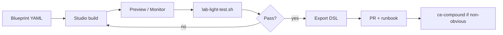

# Plan — node-builder labs (class outline → Studio templates)

**Yes — the outline is in repo.** Primary mapping:

- [CURRICULUM_REFACTOR_N8N_TO_DIFY.md](../CURRICULUM_REFACTOR_N8N_TO_DIFY.md) — module outcomes, n8n→Dify node mapping, 2-day schedule  
- [ACTION_PLAN_COURSE_DELIVERY.md](../ACTION_PLAN_COURSE_DELIVERY.md) — phases, RACI, exit criteria  
- [SPEC_CAPABILITIES.md](../SPEC_CAPABILITIES.md) — Dify surfaces and acceptance checklist  

This plan adds the **builder track**: versioned blueprints, mock tools, and light tests so multiple agents can work in parallel without each hitting OpenRouter.

---

## Goals

| Goal | How |
|------|-----|
| Satisfy Modules 1–6 outline | Six blueprints under `templates/*.lab.yaml` |
| Clear node-builder labs | Each blueprint lists canvas nodes, tools, fixtures, acceptance |
| Light tests that **complete** | `./scripts/lab-light-test.sh` (schema + fixtures + mock HTTP) |
| **One** live LLM caller | Only when `OPENROUTER_LIVE=1` + `OPENROUTER_API_KEY` in env |
| Compound loop | Build canvas → light test → export DSL → promote to `templates/` |

---

## Parallel agent rules

| Agent role | May call OpenRouter? | Work |
|------------|---------------------|------|
| Template / DSL author | **No** | Edit blueprints, runbooks, fixtures |
| Mock API / scripts | **No** | `services/mock-claims`, compose |
| Walkthrough UI | **No** (uses visitor BYO key in browser) | Next.js only |
| **Lab integrator (single)** | **Yes**, once per CI/run | `OPENROUTER_LIVE=1 ./scripts/lab-light-test.sh` |
| Instructor in Studio | Yes (operator key in `.env`) | Canvas Preview |

Do not run multiple `OPENROUTER_LIVE=1` jobs concurrently against the same lab key.

---

## Compound loop (one module iteration)



1. **Blueprint** — extend `templates/module-0N-*.lab.yaml` (already scaffolded for 1–6).  
2. **Build** — follow `nodes` + `tools` in Studio (OpenRouter from lab plugin).  
3. **Light test** — `./scripts/lab-light-test.sh` (no LLM).  
4. **Live smoke** — optional single ping via integrator agent only.  
5. **Export** — Studio DSL → `templates/exports/` then promote.  
6. **Compound** — `/ce-compound mode:non-interactive` when a non-obvious Studio/Dify quirk is solved.  

---

## Module delivery sequence (recommended)

| Sprint | Module | Builder focus | Light test ids | Portal slug |
|--------|--------|---------------|----------------|-------------|
| S0 | — | Mock claims + blueprints | `mock_claims_*`, `blueprint_*` | — |
| S1 | 1 | FAQ Chatflow (exists) | `walkthrough_faq_prompt` | `member-benefits-faq` |
| S2 | 2 | Conversation var `plan_type` | `walkthrough_memory_turns` | `member-service-memory` |
| S3 | 3 | Agent + HTTP tools → mock | `mock_claims_*` | `claims-status` |
| S4 | 4 | Parameter Extractor + If/Else | `prior_auth_incomplete_fixture` | `prior-auth-intake` |
| S5 | 5 | Human Input gate | `denial_appeal_fixture` | `denial-appeal` |
| S6 | 6 | Rubric + log review runbook | `audit_rubric_fixture` | worksheet |

**Day-of-class alignment** unchanged from action plan Day 1 (M1–3) / Day 2 (M4–6).

---

## Artifacts to add next (P1)

| Artifact | Owner | Blocks |
|----------|-------|--------|
| `docs/runbooks/module-01.md` … `module-05.md` | Instructors | Cohort delivery |
| DSL exports after Studio sign-off | Instructors | Portal BFF slug map |
| Portal BFF `POST /labs/{slug}/chat` | Portal eng | Student path |
| App API keys in secret store | Platform | Portal launch |

---

## Commands

```bash
# Mock API + blueprint/fixture checks (safe for any agent)
./scripts/lab-light-test.sh

# Single OpenRouter ping — integrator only
OPENROUTER_LIVE=1 OPENROUTER_API_KEY=sk-or-… ./scripts/lab-light-test.sh
```

---

## Walkthrough vs class path

| Surface | Audience | LLM key |
|---------|----------|---------|
| Vercel walkthrough | Collaborator demo | BYO OpenRouter in browser |
| Self-hosted Dify | Instructors / builders | Operator `OPENROUTER_API_KEY` in `.env` |
| Portal BFF (prod class) | Students | Server-side App key + gateway |

Output panels on the walkthrough were brightened for dark mode so FAQ / memory / connectivity results stay readable while builders iterate.
